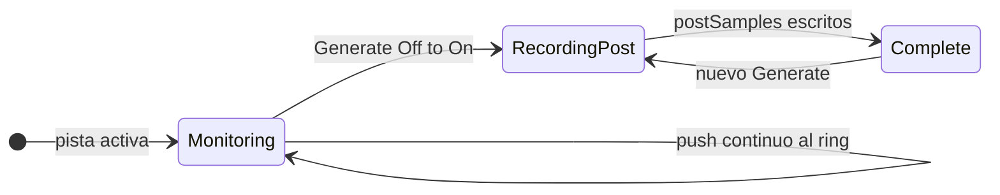

# Captura con ring buffer y pre-trigger

Documentación del módulo **Capture** (Fase 2.2): cómo el plugin guarda la respuesta del dispositivo bajo prueba sin un botón Capture manual.

## Objetivo

Grabar en memoria la señal que **entra** al plugin (retorno del dispositivo vía interface) en una ventana temporal:

- **Pre-trigger**: audio ya presente en el buffer **antes** del disparo (por defecto **100 ms**).
- **Post-trigger**: audio **después** del disparo hasta completar la duración configurada.

El disparo es **automático** en el mismo instante en que activás **Generate** (flanco Off → On), alineado con el arranque del [`SignalGenerator`](../src/dsp/SignalGenerator.cpp).

La captura queda en RAM (**una sola IR mono**, promedio L/R). El ring interno sí guarda L y R por separado, pero la deconvolución y `IRManager` trabajan un único buffer. Un loop estéreo (dos canales de mixer → Stereo In) **no** genera un IR por canal: ver la aclaración en [`CAPTURE-WORKFLOW.md`](CAPTURE-WORKFLOW.md). Al completarse, el plugin ejecuta deconvolución + ventaneo + normalización y **exporta** archivos (ver [`WINDOWING-NORMALIZATION.md`](WINDOWING-NORMALIZATION.md), [`EXPORT-FORMATS.md`](EXPORT-FORMATS.md)).

## Cadena en el estudio

```
Plugin OUT → dispositivo → interface IN → Plugin IN
                ↑                              │
                └──────── Generate (sweep) ────┘
```

Si la entrada del plugin no recibe el retorno físico, la captura será silencio o ruido de fondo: eso es esperable hasta cablear bien la loop.

## Constantes (`DevicesForge.h`)

| Constante | Valor | Uso |
|-----------|-------|-----|
| `CAPTURE_PRE_SEC` | 0.100 s | Pre-trigger |
| `CAPTURE_POST_TAIL_SEC` | 0.250 s | Cola después del fin de la excitación |
| `CAPTURE_MONITOR_SEC` | ~6 s | Capacidad del ring (pre + duración máx. + tail + margen) |

**Duración post** al disparar:

```text
postSec = max(1.0 s, signalDurationSec + CAPTURE_POST_TAIL_SEC)
```

Para **Dirac**, se usa `max(1.0 s, 1.0 s + tail)` (la duración del parámetro Duration no aplica).

**Longitud total** de la captura: `preSamples + postSamples`.

## Estados internos



En **Monitoring**, cada bloque de audio de entrada se escribe en el ring circular. En **RecordingPost**, además se copian samples al buffer de captura hasta completar el post. **Complete** indica que hay una toma lista en memoria.

## API (`RingCaptureBuffer`)

- `prepare(sampleRate, numChannels)` — reserva el ring estéreo.
- `push(inputs, numChannels, numSamples)` — escribe en el ring; si está grabando post, alimenta el snapshot mono.
- `trigger(preSamples, postSamples, metadata)` — congela el pre desde el ring e inicia el post.
- `getCapturedMono()` / `getCapturedLength()` / `isComplete()` — lectura del último take.
- `getMetadata()` — sample rate, tipo de señal, duración, índices de trigger.

## Integración en el plugin

En `DevicesForgeProcessor::process()`:

1. Se leen parámetros.
2. En flanco **Generate** On: `trigger(...)` + `generator.start()`.
3. **Siempre** que hay bus de entrada: `captureBuffer.push(...)` (también mientras suena el sweep).
4. La salida no cambia: excitación × Gain o passthrough × Gain.

No hay parámetro VST **Capture** en esta fase; Generate dispara excitación y captura a la vez.

## Cubase (verificación)

1. Insert con retorno configurado (o track que reciba el direct out del dispositivo).
2. Signal = Sweep, Duration = 1.0 s, Generate On.
3. Tras ~1.25 s la captura interna debe estar **Complete** (100 ms pre + 1 s + 250 ms tail).
4. Generate Off y volver a On: reemplaza la captura anterior.

### ⚠️ Excepción de Cubase: Monitor obligatorio

Verificado en **Cubase AI Elements 13** (aplica a toda la línea Cubase):

- El plugin **no** se inserta en el bus **Stereo In** (los buses de entrada no aceptan monitor ni rec). Va en una **pista de audio** con Input = Stereo In.
- Cubase **solo pasa la entrada en vivo por los inserts si la pista tiene Monitor activado** (ícono de parlante). Sin Monitor, el insert solo ve los clips de la pista (vacía = silencio), aunque el VU del canal muestre señal.
- **Record Enable no influye**: activarlo o no, no cambia lo que recibe el insert. Lo único determinante es **Monitor ON**.
- Si el hardware usa **Direct Monitoring** (Studio Setup → Audio System), desactivarlo: manda la entrada a la escucha sin pasar por los inserts.
- Con Monitor ON, cable de loop puesto y el sweep terminado, el passthrough puede generar **acople físico** (entrada → salida → cable → entrada). Mantener Gain ≤ −12 dB o apagar Monitor tras la toma.

Diagnóstico rápido: con Monitor ON, **InPeak** debe moverse con cualquier señal en la entrada, sin pulsar Generate. Si no se mueve, el routing sigue mal.

**Antes de Generate:** **Cal** On envía **1 kHz** continuo o un **sweep en bucle** (CalSig) × Gain, **sin** disparar captura. Ajustá el loop mirando InPeak (−18…−6 dBFS). Generate apaga Cal solo. **Generate** se apaga al terminar el sweep; **ClrLatest** On limpia `exports/latest/` al inicio de cada toma (ver [`EXPORT-FORMATS.md`](EXPORT-FORMATS.md)).

### Autotest sin DAW

`DevicesForgeHost --loopback <ruta .vst3>` simula un loop perfecto (salida → entrada por software), dispara Generate y verifica que se exporten `capture_raw` e `IR.*`. Sirve para descartar el plugin cuando se sospecha del routing del DAW.

## Fuera de alcance (Fase 2.2)

- Botón Capture manual y pre/post editables desde UI.
- Deconvolución, ventaneo, export WAV.
- Medidor “capture ready” en el editor.

Ver también: [`CAPTURE-WORKFLOW.md`](CAPTURE-WORKFLOW.md), [`SPEC.md`](SPEC.md).
