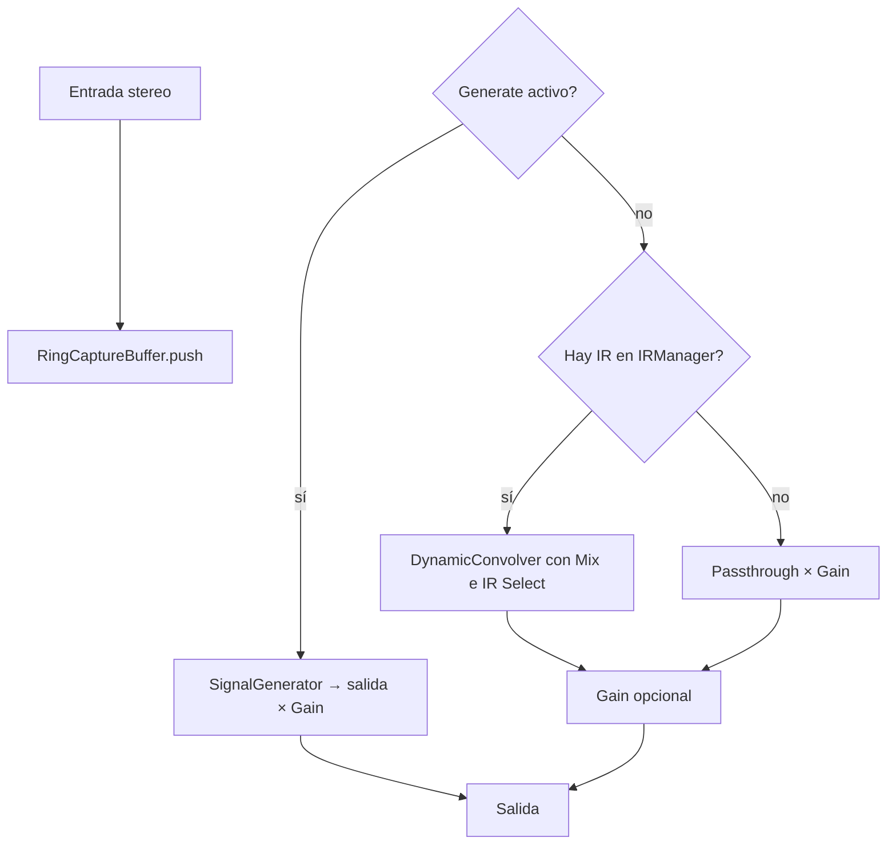

# Convolución dinámica y parámetro Mix

Documentación de **Fase 3** (emulación): qué hace `DynamicConvolver`, cómo encaja la IR capturada y cómo se usará **Mix** e **IR Select** cuando estén cableados en `process()`.

## Objetivo del concepto

Un dispositivo analógico (preamp, canal de consola, etc.) altera la señal: EQ, saturación dependiente del nivel, fase. Una forma de **emularlo en digital** es:

1. **Medir** la respuesta al impulso (IR) del dispositivo — eso ya lo hace la Fase 2 (Generate → captura → deconvolución → `IR.wav`).
2. **Convolucionar** el audio de la pista con esa IR: cada sample de salida es una mezcla ponderada de la entrada pasada (filtro con “memoria”).

```text
  Audio de la pista  ──▶  [ Convolución con IR del dispositivo ]  ──▶  suena "como pasó por el hardware"
```

Sin convolución en el plugin, la IR solo se **exporta** a disco; no escuchás la emulación en el insert.

## Qué es `DynamicConvolver`

Clase en [`src/dsp/DynamicConvolver.cpp`](../src/dsp/DynamicConvolver.cpp). Implementa **convolución en bloques** con FFT (overlap-add), no un FIR sample-a-sample gigante en CPU.

| Pieza | Rol |
|-------|-----|
| `IRManager` | Guarda una o varias IR (niveles de ganancia distintos) |
| `FFTProcessor` | FFT / IFFT y producto complejo en frecuencia |
| `overlapBuffer` | Suma de colas entre bloques (overlap-add) |
| `mix` | Mezcla dry/wet dentro del convolver |

Operación por canal (simplificado):

```text
  IR  ──FFT──▶  H(f)
  bloque de entrada  ──FFT──▶  X(f)
  Y(f) = H(f) · X(f)
  y(t) = IFFT(Y)
  salida = dry · (1 − mix) + y · mix   (+ overlap del bloque anterior)
```

**“Dinámico”** en la visión del producto: cuando existan **varias IR** capturadas a distintos niveles (−24, −12, 0, +6 dB), el plugin puede **elegir o interpolar** cuál usar según el nivel RMS de la entrada (`IRManager::getInterpolatedIR`). Hoy la captura guarda **un nivel** (`setLevelIR(0, …)`); la interpolación multi-nivel es **Fase 3 opcional**.

## De dónde sale la IR en runtime

| Origen | Cuándo |
|--------|--------|
| `processCompletedCapture()` | Tras una captura OK → `convolver.getIRManager().setLevelIR(0, ir, 0.0f)` |
| `loadIR()` / futuro “Load IR” | WAV float mono 48 kHz (loader actual es básico) |
| Tests | `generateTestIR()` |

Si no hay IR cargada, `processChannel` **no modifica** el buffer (early return).

## Parámetro **Mix** (VST id `1002`)

Definido en el controller como **porcentaje** (0–100 %). En el processor se guarda normalizado `paramMix` ∈ [0, 1].

En el código del convolver ([`DynamicConvolver::processChannel`](../src/dsp/DynamicConvolver.cpp)):

```text
salida = entrada × (1 − mix) + convolución × mix
```

| Mix | Efecto |
|-----|--------|
| **0 %** | Solo **dry** (passthrough): no se aplica la IR |
| **100 %** | Solo **wet**: toda la señal pasa por la convolución |
| **50 %** | Mezcla clásica dry/wet (útil para comparar A/B en la misma pista) |

**Importante:** **Gain** (`OUTPUT_GAIN`) es independiente: hoy multiplica la señal **después** del passthrough en `process()`. Cuando integremos el convolver, hay que acordar el orden (típico: convolver con Mix → luego Gain, o Gain solo en dry path). Documento de implementación futura: aplicar `convolver.setMix(paramMix)` cada bloque y Gain al final del buffer de salida.

## Parámetro **IR Select** (VST id `1001`)

Lista con **3 entradas** en el controller (placeholder). Previsto:

| Índice | Uso (objetivo) |
|--------|----------------|
| 0 | IR del **nivel 0** / última captura |
| 1 | Segundo nivel (multi-captura) |
| 2 | Tercer nivel o IR alternativa cargada |

`paramIRSelect` se convierte a índice (`round(norm × 3)`) y el convolver lo **limita** a los niveles realmente cargados en `IRManager`. Con un solo nivel capturado (lo normal hoy), cualquier posición de la lista usa la IR 0.

## Cómo funciona `process()` (Fase 3 — implementado)

Cuando no suena Generate: entrada → copia a salida → **convolver** (si hay IR en memoria; Mix e IR Select aplicados) → **Gain**. Sin IR, el convolver no toca el buffer (passthrough).



Reglas de producto:

- Durante **Generate** no convolucionar la pista: la salida es el **sweep** (medición), no la emulación.
- Con **Monitor ON** en Cubase, después del sweep volvés a passthrough/convolver: cuidado con **feedback** si hay loop cableado (ver [`CAPTURE-RING-BUFFER.md`](CAPTURE-RING-BUFFER.md)).

## Implementación: convolución particionada (overlap-save)

`DynamicConvolver` usa **convolución uniforme particionada**:

- FFT `CONV_FFT_SIZE = 2048` → bloque interno **B = 1024** samples.
- La IR (hasta `MAX_IR_LENGTH` = 65536) se parte en trozos de B; la FFT de cada trozo se **cachea** y solo se recalcula cuando cambia la IR (`IRManager::getRevision`) o el índice seleccionado.
- Por canal: FIFO de entrada/salida + *frequency-delay line* (historia de espectros). El **estado** es independiente (L y R no se mezclan al emular), pero la **IR es la misma** en ambos. No hay captura estéreo: ver [`CAPTURE-WORKFLOW.md`](CAPTURE-WORKFLOW.md).
- El producto y acumulación en frecuencia usan `pffft_zconvolve_accumulate` (formato interno de pffft — el orden empaquetado DC/Nyquist se maneja correctamente).
- **Mix** se aplica en tiempo con el dry retrasado B samples, así dry y wet quedan alineados (sin comb filtering).

### Latencia

El path convolucionado (y el dry mezclado) sale con **B = 1024 samples de retardo** (~21 ms @ 48 kHz). Aún **no** se reporta al host (`getLatencySamples` del convolver existe; informarlo al DAW queda para Fase 4). Para pruebas de **timbre** A/B no afecta; para alineación sample-exacta con otras pistas, tenerlo presente.

### ⚠️ Feedback con loop cableado

Con **Monitor ON** y el cable de loop puesto, al terminar el sweep la señal circula: entrada → **convolver** → salida → cable → entrada. La IR normalizada puede tener **ganancia espectral > 1** en algunas frecuencias → **acople que crece rápido**. Bajar Gain, quitar el cable o apagar Monitor apenas termina la captura. (El autotest `--loopback` del host recorta a ±1 como lo haría un conversor real.)

## La IR se guarda con el proyecto

`getState()` escribe Mix, Gain, Signal, Duration **y la IR completa** (largo en muestras + samples). Al reabrir el proyecto, `setState()` la restaura en `IRManager` y la emulación sigue funcionando sin recapturar el dispositivo.

Detalles:

- El estado pesa ~4 bytes por muestra de IR (una IR de 1,2 s a 48 kHz ≈ 238 KB).
- `IR_STATE_MAX_SAMPLES` (10 s) acota la lectura por si el stream viene corrupto.
- Los proyectos guardados con versiones anteriores solo tienen los 4 parámetros; la lectura de la IR falla sin efecto y el plugin arranca en passthrough.

Para saber si hay IR cargada está el parámetro de solo lectura **IRLen**:

| IRLen | Significado |
|-------|-------------|
| **0 ms** | No hay IR → solo pasa la señal (Mix no hace nada) |
| > 0 ms | Hay IR cargada; ese es su largo |

## Medir la ganancia de emulación sin DAW

`DevicesForgeHost --loopback` captura una IR y después mide el path convolucionado con un tono de 1 kHz a **Mix 100 % / Gain 0 dB**, reportando `ganancia: ±X dB`. Sirve para separar "el convolver atenúa" de "el DAW/los controles atenúan".

## Cómo probar el concepto

1. Capturar IR del dispositivo (Generate, Monitor, loop o insert en hardware).
2. Reproducir material **sin** Generate, **Mix = 100 %**.
3. Comparar: señal **bypass del hardware** vs señal **solo por el plugin** (misma fuente, mismos niveles aprox.).
4. Bajar **Mix** a 50 % o 0 % para verificar que la mezcla dry/wet responde.

## Referencias cruzadas

| Tema | Documento |
|------|-----------|
| Pipeline captura → IR | [`CAPTURE-RING-BUFFER.md`](CAPTURE-RING-BUFFER.md), [`WINDOWING-NORMALIZATION.md`](WINDOWING-NORMALIZATION.md) |
| Export WAV / cargar archivos | [`EXPORT-FORMATS.md`](EXPORT-FORMATS.md) |
| Roadmap Fase 3 | [`SPEC.md`](../SPEC.md) §10 |
| IA (opcional, no necesaria para convolver) | [`AI-PHASE3.md`](AI-PHASE3.md) |

---

*Documento v1.0 — Fase 3 emulación — Septiembre 2026*
